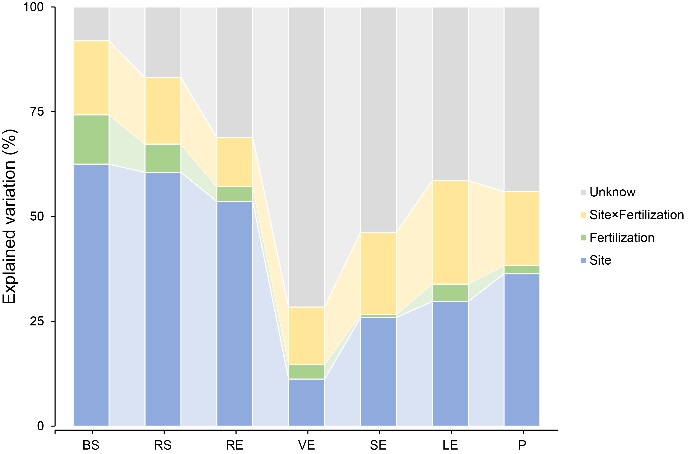

## a.PCoA
a, Unconstrained principal coordinates analysis (PCoA) with weighted unifrac distance across the whole dataset. (***P < 0.001, PerMANOVA by Adonis).
```{r PCoA,warning=FALSE}
knitr::opts_chunk$set(echo = TRUE, warning=FALSE)
sub_design = read.table("metadata.txt", header=T, row.names=1, sep="\t")
m = "weighted_unifrac"
#m = "unweighted_unifrac"
#m = "bray_curtis"
beta = read.table(paste(m,".txt",sep=""), header=T, row.names=1, sep="\t", comment.char="")
idx = rownames(sub_design) %in% rownames(beta)
sub_design=sub_design[idx,]
sub_beta=beta[rownames(sub_design),rownames(sub_design)]
pcoa = cmdscale(sub_beta, k=3, eig=T)
points = as.data.frame(pcoa$points)
colnames(points) = c("x", "y", "z")
eig = pcoa$eig
points = cbind(points, sub_design[match(rownames(points), rownames(sub_design)), ])
Compartments=factor(points$Compartments,levels = c("BS","RS","RE","VE","SE","LE","P"))
Treatment=factor(points$Treatment,levels = c("CK","NPK","NPKM"))
library(ggplot2)
col=c("#1F78B4","#A6CEE3","#B2DF8A","#33A02C","#FB9A99","#FDBF6F","#E31A1C")
p= ggplot(points, aes(x=x, y=y,color=Compartments,shape=Treatment))+ geom_point(size=3)+ 
labs(x=paste("PCoA 1 (", format(100 * eig[1] / sum(eig), digits=4), "%)", sep=""),y=paste("PCoA 2 (", format(100 * eig[2] / sum(eig), digits=4), "%)",sep=""))+scale_colour_manual(values = col)
mytheme = theme_classic() + theme(axis.text.x = element_text(size = 8),axis.text.y = element_text(size = 8))+
    theme(axis.title.y= element_text(size=12))+theme(axis.title.x = element_text(size = 12))+
    theme(legend.title=element_text(size=5),legend.text=element_text(size=5))
p=p+mytheme
p
ggsave(paste0("PCoA_", m, ".pdf", sep=""), p, width = 150, height = 120,units = "mm")
```


```{r PerMANOVA, warning=FALSE}
library(vegan)
dis = read.table(paste(m,".txt",sep=""), header=T, row.names=1, sep="\t", comment.char="")
idx = rownames(sub_design) %in% rownames(dis)
sub_design=sub_design[idx,]
sub_dis=dis[rownames(sub_design),rownames(sub_design)]
dis1 <- as.dist(sub_dis)
adonis_result <- adonis(dis1~Site+Compartments+Treatment, sub_design, permutations = 999)
adonis_result
```

## b. Explained Variation
b, Effects of site, fertilisation treatments, and site × fertilisation on bacterial community structure in each compartment as tested by PerMANOVA. 

The Figure 1b



## c.Alpha diversity
c, Violin plot showing distribution of Shannon’s index of the bacterial community in each compartment. Horizontal bars within boxes denote medians. Tops and bottoms of boxes represent 25th and 75th percentiles, and lines extend to the 1.5× interquartile range. Statistical significance between groups was determined by Wilcoxon test (PFDR < 0.05).

This figure is manually modified and stat label added by Adobe Illustrator.

```{r alpha_boxplot, echo=TRUE, warning=FALSE}
alpha = read.table("alpha.txt", header=T, row.names=1, sep="\t", comment.char="")
design = read.table("metadata.txt", header=T, row.names=1, sep="\t")
group = "Compartments"
groupID=group
idx = rownames(design) %in% rownames(alpha)
design=design[idx,]
alpha=alpha[rownames(design),]
library(Hmisc)
colnames(alpha) = capitalize(colnames(alpha))
index = "Shannon_e"
sampFile = as.data.frame(design[, groupID],row.names = row.names(design))
df = cbind(alpha[rownames(sampFile),index], sampFile)
colnames(df) = c(index,"Group")

# Test for normality and homogeneity of variance
library(car)
qqPlot(lm(df[[index]] ~ Group, data=df), simulate = TRUE, main = 'QQ Plot', labels = FALSE)
bartlett.test(df[[index]] ~ Group, data=df)

# A Kruskal-Wallis test is the nonparametric equivalent of the one-way ANOVA and is typically used when the normality assumption is violated. 
df$Group <- factor(df$Group)
model = kruskal.test(df[[index]] ~ Group, data=df)
model


group <- levels(df$Group)
group1 <- NULL
group2 <- NULL
p <- NULL

for (i in 1:(length(group) - 1)) {
    for (j in (i + 1):length(group)) {
        group1 <- c(group1, group[i])
        group2 <- c(group2, group[j])
        group_ij <- subset(df, Group %in% c(group[i], group[j]))
        group_ij$Group <- factor(group_ij$Group, levels = c(group[i], group[j]))
        
        wilcox_test <- wilcox.test(Shannon_e ~ Group, data = group_ij, alternative = 'two.sided', conf.level = 0.95)
        p <- c(p, wilcox_test$p.value)
    }
}
result <- data.frame(group1, group2, p)
result$padj <- p.adjust(result$p, method = 'BH')	#Benjamini  p 
result

# violin plotting
library(ggplot2)
col=c("#1F78B4","#A6CEE3","#B2DF8A","#33A02C","#FB9A99","#FDBF6F","#E31A1C")
p = ggplot(df, aes(x=Group, y=df[[index]], fill=Group)) + 
  geom_violin(position = position_dodge(width = 0.1), scale = 'width')+  
  geom_boxplot(alpha=1,outlier.size=0, size=0.3, width=0.3,fill="white") +
  scale_fill_manual(values = col)+
  labs(x="Compartments", y="Shannon index", color=groupID)+
  scale_x_discrete(limits=c("BS","RS","RE","VE","SE","LE","P"))
mytheme = theme_classic() + theme(axis.text.x = element_text(size = 8),axis.text.y = element_text(size = 8))+
    theme(axis.title.y= element_text(size=12))+theme(axis.title.x = element_text(size = 12))+
    theme(legend.title=element_text(size=5),legend.text=element_text(size=5))
p=p+mytheme
p
ggsave("alpha_violin.pdf", p, width = 150, height = 120,units = "mm")
```

## d,e,f Distance-decay curves (d,e,f) 
d–f, Distance-decay curves showing Bray–Curtis similarity against geographic distances (d), edaphic distances (e), and climatic distances (f). Solid lines represent ordinary least-squares linear regressions. 

d.geographic distances 
```{r geographic distances, warning=FALSE}
site_all <- read.delim('env_all_gd.txt', sep = '\t', row.names = 1, check.names = FALSE)
m="BS"
#m="RS"
#m="RE"
#m="VE"
#m="SE"
#m="LE"
#m="P"
site = subset(site_all, site_all$SiteTre %in% c(m))
# geosphere::distm() function to calculate the distance between the set of coordinates
library(geosphere)
site_dis <- geosphere::distm(site[c('Longitude', 'Latitude')],fun = distHaversine)  
rownames(site_dis) <- rownames(site)
colnames(site_dis) <- rownames(site)
site_dis <- reshape2::melt(site_dis)
site_dis <- subset(site_dis, value != 0)
n="otu_filter_rare_BS.txt"
#n="otu_filter_rare_RS.txt"
#n="otu_filter_rare_RE.txt"
#n="otu_filter_rare_VE.txt"
#n="otu_filter_rare_SE.txt"
#n="otu_filter_rare_LE.txt"
#n="otu_filter_rare_P.txt"
spe <- read.delim(paste(n,"", sep =""), row.names = 1, check.names = FALSE)
spe <- data.frame(t(spe))
# The vegan package vegdist () calculates Bray-curtis dissimilarity 
comm_sim <- 1 - as.matrix(vegan::vegdist(spe, method = 'bray')) # 1-Bray-curtis distance
diag(comm_sim) <- 0 
comm_sim[upper.tri(comm_sim)] <- 0
comm_sim <- reshape2::melt(comm_sim)
comm_sim <- subset(comm_sim, value != 0)
comm_dis <- merge(comm_sim, site_dis, by = c('Var1', 'Var2'))
names(comm_dis) <- c('site1', 'site2', 'comm_sim', 'site_dis')
site_edge <- rownames(subset(site_all, SiteTre == m))
comm_dis[which(as.character(comm_dis$site1) %in% site_edge | as.character(comm_dis$site2) %in% site_edge),'compartment'] <- m
write.table("\t", file=paste("comm_dis_", m, ".txt",sep=""),append = F, quote = F, eol = "", row.names = F, col.names = F)
suppressWarnings(write.table(comm_dis, file=paste("comm_dis_", m, ".txt",sep=""), append = T, quote = F, sep="\t", eol = "\n", na = "NA", dec = ".", row.names = T, col.names = T))


# model parameters of distance-decay relationships 
fit <- lm(comm_sim~site_dis, data = comm_dis)
summary(fit)


#merge BS,RS,RE,VE,SE,LE and P
BS = read.table("comm_dis_BS.txt", header=T, row.names=1, sep="\t", comment.char="")
RS = read.table("comm_dis_RS.txt", header=T, row.names=1, sep="\t", comment.char="")
RE = read.table("comm_dis_RE.txt", header=T, row.names=1, sep="\t", comment.char="")
VE = read.table("comm_dis_VE.txt", header=T, row.names=1, sep="\t", comment.char="")
SE = read.table("comm_dis_SE.txt", header=T, row.names=1, sep="\t", comment.char="")
LE = read.table("comm_dis_LE.txt", header=T, row.names=1, sep="\t", comment.char="")
P = read.table("comm_dis_P.txt", header=T, row.names=1, sep="\t", comment.char="")
comm_dis_all <- rbind(BS,RS,RE,VE,SE,LE,P) 

library(ggplot2)
col=c("#1F78B4","#B2DF8A","#A6CEE3","#FB9A99","#33A02C","#FDBF6F","#E31A1C")
p <- ggplot(comm_dis_all,aes(x=site_dis/1000,y=comm_sim,color=compartment))+
  geom_point(size=2,shape=1)+
  stat_smooth(method = lm, aes(color = compartment, fill = compartment))+
  scale_color_manual(values= col)+
  scale_fill_manual(values= col)+
  labs(x = 'Geographic distance (km)', y = 'Bray-curtis similarity\n')
p=p+scale_x_continuous(breaks = c(500,1000,1500,2000,2500))
mytheme = theme_classic() + theme(axis.text.x = element_text(size = 8),axis.text.y = element_text(size = 8))+
    theme(axis.title.y= element_text(size=12))+theme(axis.title.x = element_text(size = 12))+
    theme(legend.title=element_text(size=5),legend.text=element_text(size=5))
p=p+mytheme
p
ggsave("Bray-curtis similarity_Geo.pdf", p, width = 150, height = 120,units = "mm")
```


e.edaphic distances 
```{r edaphic distances, warning=FALSE}
eda_all <- read.delim('env_all_ed.txt', sep = '\t', row.names = 1, check.names = FALSE) 
eda_all = eda_all[,-9] # delete AN columns
m="BS"
#m="RS"
#m="RE"
#m="VE"
#m="SE"
#m="LE"
#m="P"
eda = subset(eda_all, eda_all$SiteTre %in% c(m))
eda = eda[,-1]
# To calculate the Euclidean distance of the edaphic parameters
scale.eda <- scale(eda, center = TRUE, scale = TRUE)
dist.eda <- dist(scale.eda, method = 'euclidean')
dist.eda=as.matrix(dist.eda)
dist.eda[upper.tri(dist.eda)] <- 0
dist.eda <- reshape2::melt(dist.eda)
dist.eda <- subset(dist.eda, value != 0)

#The vegan package vegdist () calculates Bray-curtis dissimilarity 
n="otu_filter_rare_BS.txt"
#n="otu_filter_rare_RS.txt"
#n="otu_filter_rare_RE.txt"
#n="otu_filter_rare_VE.txt"
#n="otu_filter_rare_SE.txt"
#n="otu_filter_rare_LE.txt"
#n="otu_filter_rare_P.txt"
spe <- read.delim(paste(n,"", sep =""), row.names = 1, check.names = FALSE)
spe <- data.frame(t(spe))
comm_sim <- 1 - as.matrix(vegan::vegdist(spe, method = 'bray'))
diag(comm_sim) <- 0  
comm_sim[upper.tri(comm_sim)] <- 0  
comm_sim <- reshape2::melt(comm_sim)
comm_sim <- subset(comm_sim, value != 0)
comm_eda <- merge(comm_sim, dist.eda, by = c('Var1', 'Var2'))
names(comm_eda) <- c('ed1', 'ed2', 'comm_sim', 'dist.eda')
ed_edge <- rownames(subset(eda_all, SiteTre == m))
comm_eda[which(as.character(comm_eda$ed1) %in% ed_edge | as.character(comm_eda$ed2) %in% ed_edge),'Compartment'] <- m
write.table("\t", file=paste("comm_eda_", m, ".txt",sep=""),append = F, quote = F, eol = "", row.names = F, col.names = F)
suppressWarnings(write.table(comm_eda, file=paste("comm_eda_", m, ".txt",sep=""), append = T, quote = F, sep="\t", eol = "\n", na = "NA", dec = ".", row.names = T, col.names = T))


# model parameters of distance-decay relationships 
fit<- lm(comm_sim~dist.eda, data = comm_eda)
summary(fit)

#merge BS,RS,RE,VE,SE,LE and P
BS = read.table("comm_eda_BS.txt", header=T, row.names=1, sep="\t", comment.char="")
RS = read.table("comm_eda_RS.txt", header=T, row.names=1, sep="\t", comment.char="")
RE = read.table("comm_eda_RE.txt", header=T, row.names=1, sep="\t", comment.char="")
VE = read.table("comm_eda_VE.txt", header=T, row.names=1, sep="\t", comment.char="")
SE = read.table("comm_eda_SE.txt", header=T, row.names=1, sep="\t", comment.char="")
LE = read.table("comm_eda_LE.txt", header=T, row.names=1, sep="\t", comment.char="")
P = read.table("comm_eda_P.txt", header=T, row.names=1, sep="\t", comment.char="")
comm_eda_all <- rbind(BS,RS,RE,VE,SE,LE,P) 
library(ggplot2)
col=c("#1F78B4","#B2DF8A","#A6CEE3","#FB9A99","#33A02C","#FDBF6F","#E31A1C")
p <- ggplot(comm_eda_all,aes(x=dist.eda,y=comm_sim,color=Compartment))+
  geom_point(size=2,shape=1,alpha=0.5)+
  stat_smooth(method = lm, aes(color = Compartment, fill = Compartment))+
  scale_color_manual(values= col)+
  scale_fill_manual(values= col)+
  labs(x = 'Edaphic distance (Euclidean)', y = 'Bray-curtis similarity\n')
mytheme = theme_classic() + theme(axis.text.x = element_text(size = 8),axis.text.y = element_text(size = 8))+
    theme(axis.title.y= element_text(size=12))+theme(axis.title.x = element_text(size = 12))+
    theme(legend.title=element_text(size=5),legend.text=element_text(size=5))
p=p+mytheme
p
ggsave("Bray-curtis similarity_eda.pdf", p, width = 150, height = 120,units = "mm")
```


f.climatic distances
```{r warning=FALSE}
cd_all <- read.delim('env_all_cd.txt', sep = '\t', row.names = 1, check.names = FALSE)  
m="BS"
#m="RS"
#m="RE"
#m="VE"
#m="SE"
#m="LE"
#m="P"
cd = subset(cd_all, cd_all$SiteTre %in% c(m))
cd = cd[,-1]
scale.cd <- scale(cd, center = TRUE, scale = TRUE)
dist.cd <- dist(scale.cd, method = 'euclidean')
dist.cd=as.matrix(dist.cd)
dist.cd[upper.tri(dist.cd)] <- 0  
dist.cd <- reshape2::melt(dist.cd)
dist.cd <- subset(dist.cd, value != 0)

#The vegan package vegdist () calculates Bray-curtis dissimilarity 
n="otu_filter_rare_BS.txt"
#n="otu_filter_rare_RS.txt"
#n="otu_filter_rare_RE.txt"
#n="otu_filter_rare_VE.txt"
#n="otu_filter_rare_SE.txt"
#n="otu_filter_rare_LE.txt"
#n="otu_filter_rare_P.txt"
spe <- read.delim(paste(n,"", sep =""), row.names = 1, check.names = FALSE)
spe <- data.frame(t(spe))
comm_sim <- 1 - as.matrix(vegan::vegdist(spe, method = 'bray'))
diag(comm_sim) <- 0  
comm_sim[upper.tri(comm_sim)] <- 0  
comm_sim <- reshape2::melt(comm_sim)
comm_sim <- subset(comm_sim, value != 0)

comm_cd <- merge(comm_sim, dist.cd, by = c('Var1', 'Var2'))
names(comm_cd) <- c('cd1', 'cd2', 'comm_sim', 'dist.cd')
cd_edge <- rownames(subset(cd_all, SiteTre == m))
comm_cd[which(as.character(comm_cd$cd1) %in% cd_edge | as.character(comm_cd$cd2) %in% cd_edge),'Compartment'] <- m
write.table("\t", file=paste("comm_cd_", m, ".txt",sep=""),append = F, quote = F, eol = "", row.names = F, col.names = F)
suppressWarnings(write.table(comm_cd, file=paste("comm_cd_", m, ".txt",sep=""), append = T, quote = F, sep="\t", eol = "\n", na = "NA", dec = ".", row.names = T, col.names = T))


# model parameters of distance-decay relationships 
fit<- lm(comm_sim~dist.cd, data = comm_cd)
summary(fit)


#merge BS,RS,RE,VE,SE,LE and P
BS = read.table("comm_cd_BS.txt", header=T, row.names=1, sep="\t", comment.char="")
RS = read.table("comm_cd_RS.txt", header=T, row.names=1, sep="\t", comment.char="")
RE = read.table("comm_cd_RE.txt", header=T, row.names=1, sep="\t", comment.char="")
VE = read.table("comm_cd_VE.txt", header=T, row.names=1, sep="\t", comment.char="")
SE = read.table("comm_cd_SE.txt", header=T, row.names=1, sep="\t", comment.char="")
LE = read.table("comm_cd_LE.txt", header=T, row.names=1, sep="\t", comment.char="")
P = read.table("comm_cd_P.txt", header=T, row.names=1, sep="\t", comment.char="")
comm_cd_all <- rbind(BS,RS,RE,VE,SE,LE,P) 

library(ggplot2)
col=c("#1F78B4","#B2DF8A","#A6CEE3","#FB9A99","#33A02C","#FDBF6F","#E31A1C")
p <- ggplot(comm_cd_all,aes(x=dist.cd,y=comm_sim,color=Compartment))+
  geom_point(alpha=0.03)+
  stat_smooth(method = lm, aes(color = Compartment, fill = Compartment))+
  scale_color_manual(values= col)+
  scale_fill_manual(values= col)+
  labs(x = 'Climatic distance (Euclidean)', y = 'Bray-curtis similarity\n')
mytheme = theme_classic() + theme(axis.text.x = element_text(size = 8),axis.text.y = element_text(size = 8))+
    theme(axis.title.y= element_text(size=12))+theme(axis.title.x = element_text(size = 12))+
    theme(legend.title=element_text(size=5),legend.text=element_text(size=5))
p=p+mytheme
p
ggsave("Bray-curtis similarity_cd.pdf", p, width = 150, height = 120,units = "mm")
```