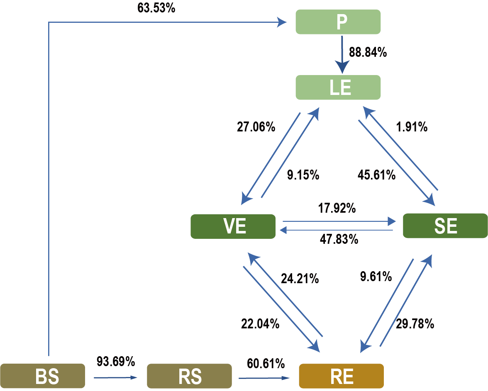
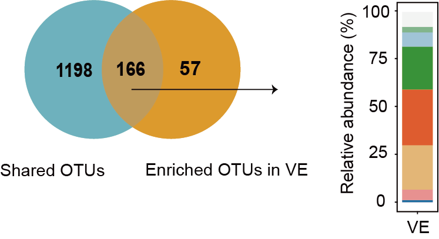
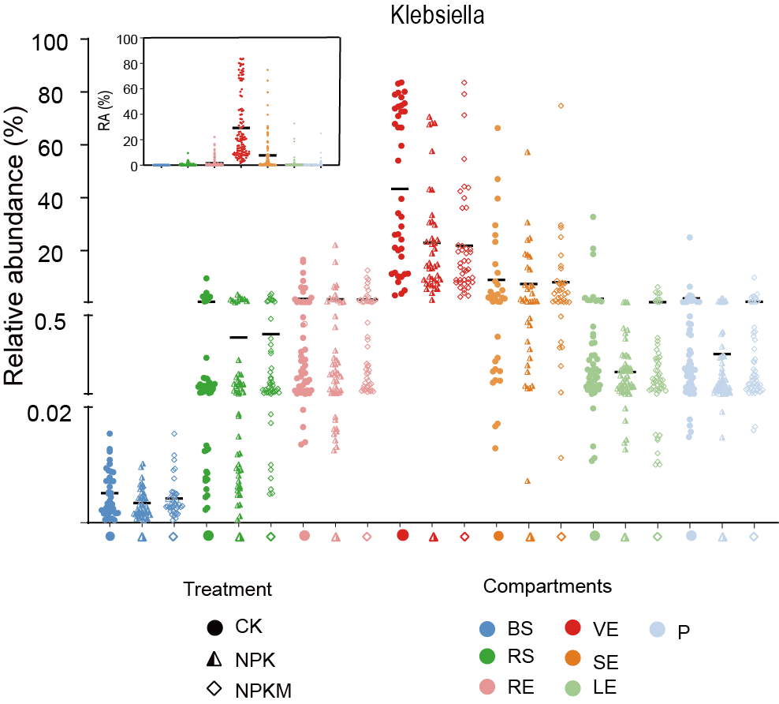

## a.Taxonomy composition
a,Phylum-level distribution of bacterial communities across the whole dataset.Proteobacteria are shown at the class level. 
```{r taxonomy, echo=TRUE,warning=FALSE}
sub_merge <- read.table('sub_tax_design.txt', row.names = 1, stringsAsFactors = FALSE, check.names = FALSE)
library(ggplot2)
sub_merge$Comparts<-factor(sub_merge$Comparts,levels=c("BS", "RS", "RE", "VE","SE","LE","P"), labels = c("BS", "RS", "RE", "VE","SE","LE","P"))
sub_merge$Phylum<-factor(sub_merge$Phylum,levels=c("Abditibacteriota", "Acidobacteriota", "Actinobacteriota","Alphaproteobacteria", "Bacteroidota","Chloroflexi","Deinococcota","Firmicutes","Gammaproteobacteria","Gemmatimonadota","Myxococcota","Nitrospirota","unclassified","Others"), labels = c("Abditibacteriota", "Acidobacteriota", "Actinobacteriota","Alphaproteobacteria", "Bacteroidota","Chloroflexi","Deinococcota","Firmicutes","Gammaproteobacteria","Gemmatimonadota","Myxococcota","Nitrospirota","unclassified","Others"))
phy.cols <- c("#FF6A6A",  "#FF8247", "#FFE7BA", "#87CEFA","#B0E0E6",  "#48D1CC", "#5F9EA0", "#66CDAA", "#458B00","#BCEE68","#FFF68F", "#EEEE00","#FFFFE0","#8B8682") 
p=ggplot(sub_merge, aes(x = TreatmentID, y = RA, fill=Phylum)) +
    geom_bar(stat='identity', position = "fill")+  
    labs(x="Treatment",y="Relative abundance")+
    facet_grid(Site+Soiltype~Comparts,scales= "free" ,space= "free")+
    theme_bw()+
    scale_fill_manual(values=phy.cols ) 
p=p+theme(axis.text.x = element_blank())
p
ggsave("tax_all.pdf", p, width=150, height=120, units="mm")
```

## b.FEAST
b,Potential sources of maize bacterial communities as determined by FEAST.

This figure is manually drawn by Adobe Illustrator.



## c.UpSetR
c, Vertical bars of upper plot show number of intersecting operational taxonomic units (OTUs) among plant compartments and soil, denoted by connected black circles below the histogram. Orange bars and circles represent OTUs that overlap among seven compartments, horizontal bars show OTUs set size.

```{r UpSetR, warning=FALSE}
library(UpSetR)#R 3.5
otu_RA <- read.delim('otu_RA.txt', header = TRUE, row.names = 1, sep = '\t')
otu_RA[otu_RA > 0] <- 1
p <- upset(otu_RA, nset = 7, nintersects = 10, order.by = c('degree','freq'), decreasing = c(TRUE, TRUE),
            mb.ratio = c(0.7, 0.3),
            point.size = 1.8,
            line.size = 1, 
            mainbar.y.label = "Intersection size", 
            sets.x.label = "Set Size", 
            main.bar.color = "#2a83a2", sets.bar.color = "#3b7960",
            queries = list(list(query = intersects, params = list("BS","RS","RE","VE","SE","LE","P"), active = T,color="#d66a35", query.name = "BS vs RS vs RE vs VE vs SE vs LE vs P")))
p
select_otu <- rownames(otu_RA[rowSums(otu_RA[1:7]) == 7, ])
otu_select <- otu_RA[select_otu, ]
write.table(as.matrix(otu_select),"otu_overlap.txt",sep = '\t',quote = FALSE,col.names = NA)
dev.off()
```

## d.Venn
d, Venn diagram showing overlap between shared and enriched OTUs, and their relative abundance at genus level.

This venn plot is drawn by EVenn online tool, this bar is drawn by GraphPad Prism8.0.0 and they are manually merged by Adobe Illustrator.



## e.top genus
e, Abundance profile of OTUs overlapping along plant compartments as denoted by curves.
```{r  warning=FALSE}
library(ggplot2)
library(ggalt) #R4.0 or above
top_genus = read.delim("top_genus.txt", header=T, row.names=1, sep="\t",stringsAsFactors = FALSE,check.names = FALSE)
top_genus$Genus<-factor(top_genus$Genus,levels=c("Bacillus","Cronobacter","Unclassified_Enterobacterales","Klebsiella","Pantoea","Pseudomonas","Rosenbergiella"), labels = c("Bacillus","Cronobacter","Unclassified_Enterobacterales","Klebsiella","Pantoea","Pseudomonas","Rosenbergiella"))
phy.cols <- c("#85BA8F", "#A3C8DC", "#349839","#EA5D2D","#EABB77","#F09594","#2072A8")

p=ggplot(data=top_genus,aes(x=Compartment,y=RA,group=Genus,colour=Genus))+
  geom_point(size=3)+
  labs(x="Compartments", y="Relative abundance (%)")+
  geom_xspline(spline_shape = -0.5)+scale_x_discrete(limits=c("RS","RE","VE","SE","LE","P"))+
  scale_colour_manual(values=phy.cols) 
mytheme = theme_bw() +
    theme(axis.text.x = element_text(size = 8),axis.text.y = element_text(size = 8))+
    theme(axis.title.y= element_text(size=12))+theme(axis.title.x = element_text(size = 12))+
    theme(legend.title=element_text(size=5),legend.text=element_text(size=5))+theme(legend.position = "bottom")
p=p+mytheme
p
```

##f.Ternary plots 
f, Ternary plots of OTUs in xylem sap across three fertilisation treatments. Size of each point represents relative abundance of OTU. Position is determined by the contribution of three fertilisation treatments to the total relative abundance, proximity to that vertex indicates enrichment of that OTU in that fertilisation treatment. Colours of circles correspond to different genera. Grey circles indicate OTUs with no significant differences in abundance

```{r Ternary plots, warning=FALSE}
library(ggtern)
plot_data = read.table("Tern_data.txt", header=T, row.names= 1, sep="\t", comment.char = "")
p <- ggtern(data=plot_data, aes(x=CK, y=NPK, z=NPKM)) + 
  geom_mask() + 
  geom_point(aes(size=size, color=Genus),alpha=0.8) +
  scale_size(range = c(0, 10)) +
  scale_color_manual(values  = c('#E31A1C','#228B22','#1F78B4', '#FDB462', '#8B658B',  '#4876FF', '#00BFFF', '#EE82EE','#8B8682','#CDC9C9'), limits = c('Klebsiella','Pseudomonas','Enterobacteriaceae_unclassified','Rosenbergiella','Oxalobacteraceae_unclassified','Sphingobacterium','Lactococcus','Erwinia','Others','NotSig')) +
  guides(size="none") +theme_bw() +
  theme(axis.text=element_blank(), axis.ticks=element_blank())
p
```

##g.Dot plots
g, Distribution of Klebsiella in each compartment under fertilisation treatments. Horizontal black bars represent the mean of each group.

This figure is drawn by GraphPad Prism8.0.0., and manually merged by Adobe Illustrator.


