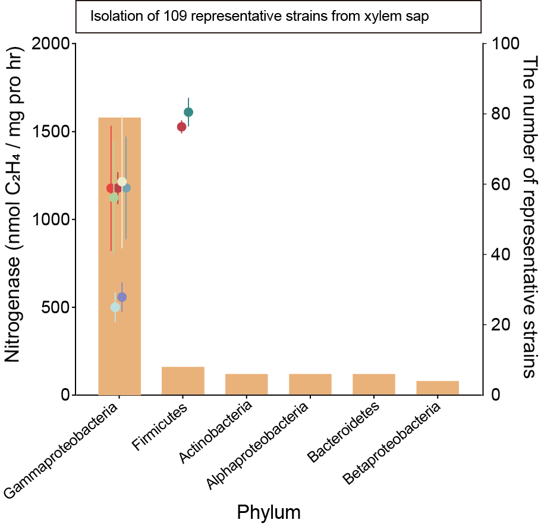
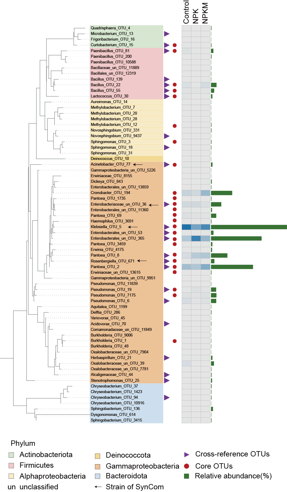
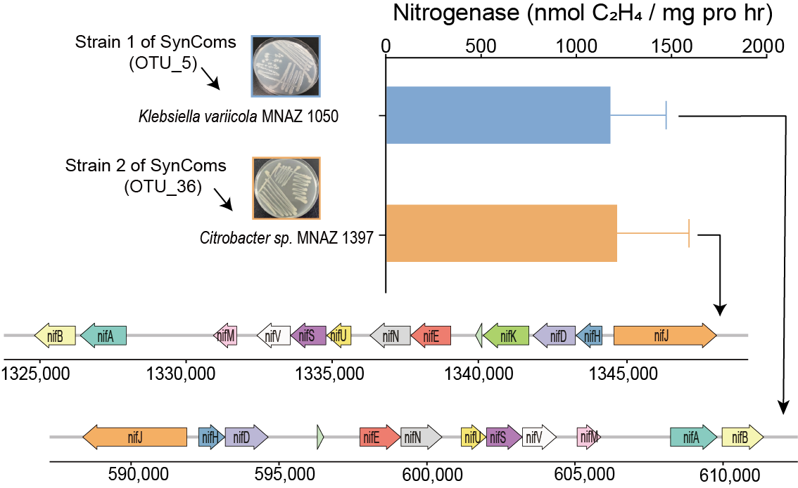
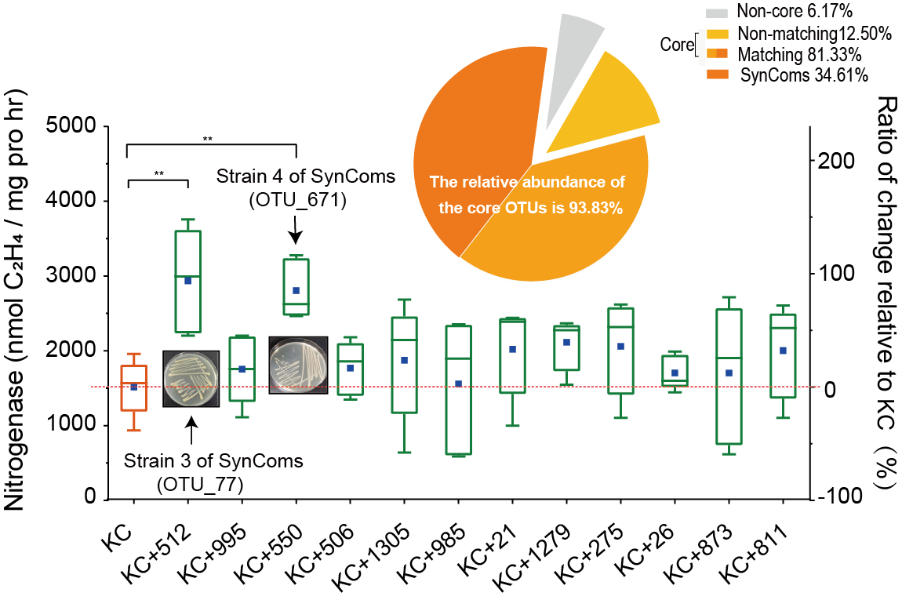

##a.Dot plot
a, Occupancy–abundance curves for vascular tissue communities. X-axis displays the log-transformed mean relative abundance of each OTU, y axis displays percentage of samples in which each OTU was detected. OTUs with 1 occupancy are shown in red (core taxa); blue circles represent taxa shared among soil and plant compartments; grey squares indicate non-shared OTUs.
```{r occ_abun, warning=FALSE}
library(tidyverse)
library(reshape2)
library(vegan)
theme_set(theme_light())
map = read.table("metadata_VE.txt", header=T, row.names=1, sep="\t")
otu = read.table("otu_VE.txt", header=T, row.names=1, sep="\t")
otu_PA <- 1*((otu>0)==1)                                                 # presence-absence data
otu_occ <- rowSums(otu_PA)/ncol(otu_PA)                                # occupancy calculation
otu_rel <- apply(decostand(otu, method="total", MARGIN=2),1, mean)     # relative abundance  
occ_abun <- add_rownames(as.data.frame(cbind(otu_occ, otu_rel)),'otu') # combining occupancy and abundance 
write.table(as.matrix(occ_abun),"occ_abun.txt",sep = '\t',quote = FALSE,col.names = NA)
#After the dataframe is exported, manually add a column named "fill"(Core,Compartment,no)

occ_abun = read.table("occ_abun_new.txt", header=T, row.names=1, sep="\t")
p=ggplot(data=occ_abun, aes(x=log10(otu_rel), y=otu_occ,color=fill,shape=fill))+
  geom_point(size = 3)+scale_color_manual(values=c('#82ADDC','#BE1A20','#CDCDC1'))+ 
  scale_shape_manual(values = c(19,19,13))+
  labs(x=paste('log(mean relative abundace per OTU)\n (n=',nrow(occ_abun),' OTUs)',sep=''), y=paste('Occupancy (n=',ncol(otu),')', sep=''), fill=NULL)
mytheme = theme_classic() + theme(axis.text.x = element_text(size = 8),axis.text.y = element_text(size = 8))+
    theme(axis.title.y= element_text(size=12))+theme(axis.title.x = element_text(size = 12))+
    theme(legend.title=element_text(size=5),legend.text=element_text(size=5))
p=p+mytheme
p
```

##b.Bar graph
b, Bar graph depicting number of representative strains at phylum or class level. Points indicate mean nitrogenase activity of diazotrophs at each phylum or class level; error bars indicate standard deviation (n = 5 for each strain).

 This figture is drawn by GraphPad Prism8.0.0.
 


##c.Cladogram
 c, Cultivation-dependent coverage of OTUs in vascular tissues. Inner column represents OTUs in vascular tissues with relative abundance >0.01%. Red circles represent core OTUs, which are the same as Fig. 4a. Purple triangles mark OTUs that matched with culturable bacteria. White and blue heatmap represents differences in relative abundance among fertilisation treatments. Green bar graph represents relative abundance of OTUs with a maximum value of 29.2%.

This figture is drawn by iTOL.v6.4.




##d.Combination plot
d, Nitrogenase activity of two core strains (MNAZ1050 and MNAZ1397). Arrows mark nif genes with locations shown below arrows.

This figture is drawn by GraphPad Prism8.0.0., and merged by Adobe Illustrator.



##e.Combination plot
e, Nitrogenase activity of 12 combinations relative to KC (KC denotes combination of two diazotrophs, MNAZ1050 and MNAZ1397). Blue rectangles represent mean values of each combination. Horizontal bars within boxes denote medians. Tops and bottoms of boxes represent 25th and 75th percentiles, and lines extend to 1.5× interquartile range. Pie plot shows total relative abundance of each group (core OTUs, non-core OTUs, matching OTUs, non-matching OTUs, SynComs (synthetic communities)).
This figture is drawn by GraphPad Prism8.0.0., and merged by Adobe Illustrator.

